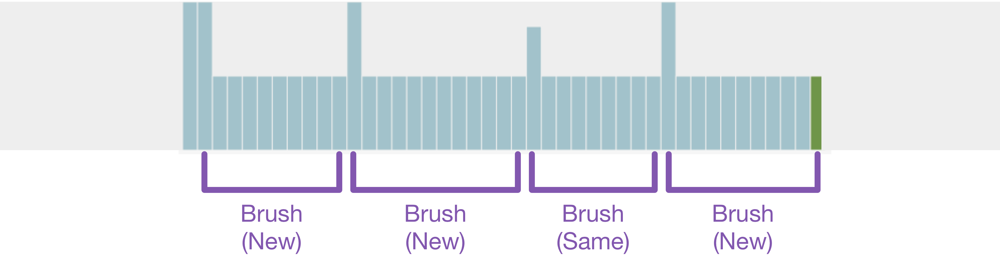
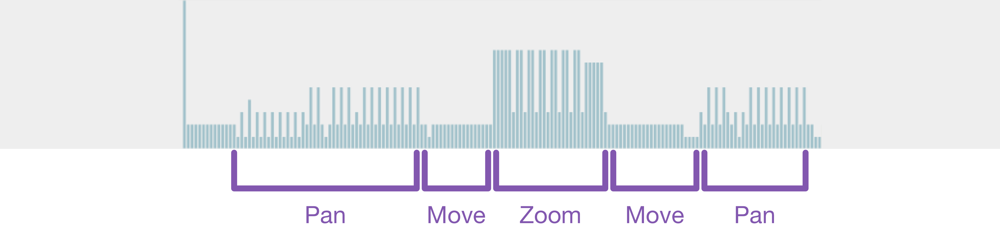
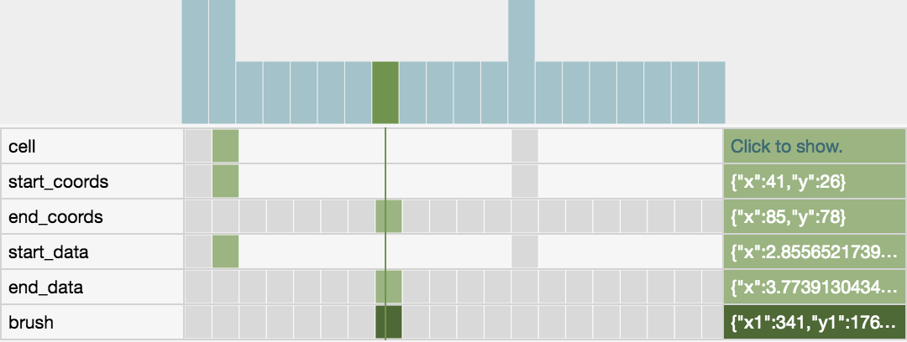
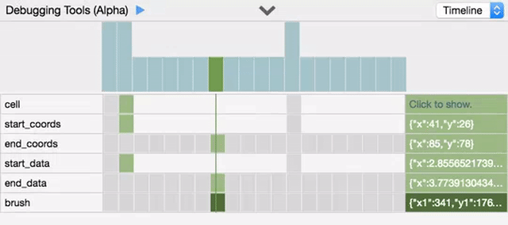
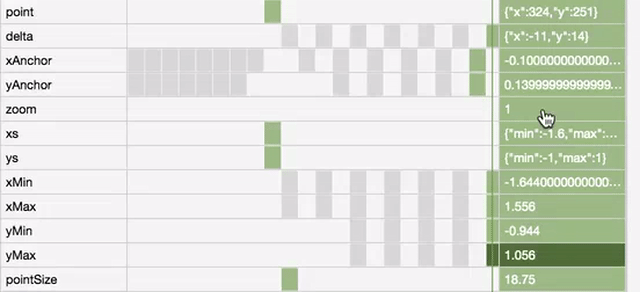
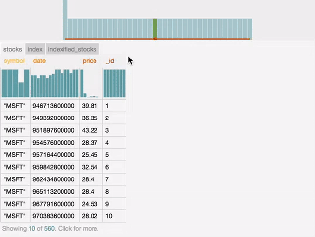
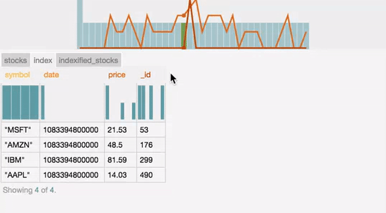

# Debugging Vega

The online Vega editor contains debugging tools to help you develop visualizations. These tools are available by clicking the  symbol. Opening the debugging tools opens a new panel at the bottom of the specification area. The debugging tools include three components: a **timeline** of signals, **visualization annotations**, and **dynamic data tables**.

In this tutorial, we show example debugging outputs from three visualizations from the [online Vega Editor](http://vega.github.io/vega-editor): `index_chart`, `linking`, `panzoom_points`. We highly encourage your to try out the various debugging techniques alongside this tutorial.

## Signal Timeline and Replay

The signal timeline automatically tracks updates to signal values during interaction and supports replay to previous timesteps of the visualization. The timeline is initialized with all signals defined in the specification and updates automatically as you interact. The timeline contains a number of different components:

* Overview - the number of signals updated in each timestep
* Timeline - the values of signals at each timestep
* Signal Names - selecting a signal name highlights all occurrences of it in the specification
* Cursor - the cursor line shows the current timestep
* Signal Values - the values of each signal at the current timestep as indicated by the cursor


### Overview

The height of each bar in the overview shows the number of signals that are updated in a given timestep of the interaction. The currently selected signal value is colored in green. Dragging along the overview filters the timeline to show only the highlighted timesteps. The overview can be useful for identifying trends in the interaction and identifying points of interest:

In the `index_chart` visualization, there is only one consistent form of interaction: `mousemove`.


Brushes have a distinct pattern: one timestep for initializing the `brush_start` and `brush_end` signals and many timesteps that update `brush_end`. In the `linking` visualization, you can brush different cells of the visualization; brushing the same cell as the previous interaction has a slightly different interaction signature.



In the `panzoom_points` visualization, there are many interactions that are recorded, each with a different pattern. On `mousemove` only the `xAnchor` and `yAnchor` signals are updated. While panning, updates to the `Min`/`Max` signals are interleaved with updates to the `Anchor` signals. While zooming, the `zoom`, `xs`, and `ys` update in addition to the `Min`/`Max` signals from the panning interaction. The difference in the number of signals updated at each timestep creates different interaction signatures in the overview.



### Timeline

Each time a signal is updated a box is added to the timeline to represent the new value. The cursor indicates the current timestep of the visualization (with the currently selected signal in dark green); light green shows the value of each signal relative to the currently selected point. The signal values for the current timestep are shown on the right using the same color scheme.



In this case, the `linking` visualization has been replayed to the middle of one of the brushing interactions. The current value of `start_coords` is `{"x": 41, "y": 26}` which was initialized at the start of the brush and hasn't been updated since. The `end_coords` signal updates as your drag out the brush; the value at the current timestep of replay is `{"x": 85, "y": 78}`. The last signal to be updated in this timestep was the `brush` signal, which extracts the `x` and `y` values from `start_coords` and `end_coords` to determine the absolute pixel values for the brush based on which `cell` it was drawn in.

```json
{
  "name": "brush",
  "init": {"x1": 0, "y1": 0, "x2": 0, "y2": 0},
  "streams": [{
    "type": "start_coords, end_coords",
    "expr": "{x1: cell.x + start_coords.x, y1: cell.y + start_coords.y, x2: cell.x + end_coords.x, y2: cell.y + end_coords.y}"
  }]
}
```

As shown here, signals may be used in the definition of other signals in the specification. Hovering over a signal value in the timeline shows the **dependencies** of that value. As you can see here, the `brush` signal uses the values of `start_coords`, `end_coords`, and `cell` to compute the resulting value of the signal. The exact values that are used are highlighted with a red border. Hovering over a signal value in the timeline also shows the value as a tooltip in the overview.



Signals may also include a scale property that applies a scale transformation to the stream expression. The timeline shows the transformed signal value in the right-hand column; hovering over the value shows the original input from the stream along with the transformation. In the `panzoom_points` visualization, a scale transformation is used on the `yAnchor` signal to transform the resulting pixel from `mousemove` into the appropriate data value:

```json
{
  "name": "yAnchor",
  "init": 0,
  "streams": [{
    "type": "mousemove",
    "expr": "eventY()",
    "scale": {"name":"y", "invert":true}
  }]
}
```



### Replay

Replaying to a previous timestep updates the timeline and the visualization. When in replay mode, the visualization is grayed out and interactions are disabled. When replaying, you can also view **visualization annotations**. There are three ways to replay the visualization to a previous timestep:

1. Select the pause () button on the debugging panel.
2. Use your keyboard's arrow keys to navigate between timesteps of the visualization. <br> Left/Right arrows move between timesteps. <br> Up/Down arrows move between signal values within a given timestep.
3. Select a signal value on the timeline to replay directly to that timestep.

## Visualization Annotations

 When replaying the visualization, you can view relevant encodings as an annotation on the visualization. The annotation appears as a tooltip that shows all encodings that are parameterized by a scale transformation in the specification. The encodings shown in the annotation are relative to the current scope of the visualization, which can be particularly helpful for understanding the behavior of layered, stacked, or small multiple visualizations. For example, in the `linking` visualization the `gx` and `gy` scales determine the position of each cell in the scatterplot matrix. Within each cell, a different `x` and `y` scale determines the position of points. Finally, a top-level scale 'c' determines the color of highlighted points based on the species. When using the visualization annotation, it is easy to view the relevant encodings for the current cursor location. If there are no encodings on the visualization, the tooltip shows the `xy` pixel location (for example, see the `wordcloud` visualization).

## Dynamic Data Tables

The dynamic data tables show all the named datasets you define in the specification. These data tables are available for static visualizations as well as for debugging interactive visualizations. The data table contains a number of different components:

* Overview - augmented with the variability of the data attributes
* Data Tables - tabs for each named dataset
* Data Attributes - selecting the name of a data attribute highlights all occurrences in the specification
* Distribution - histograms of the distribution of attribute values
* Data Points - a row for each data point in the dataset (10 visible by default)


### Attribute Variability

The data tables update as interactions occur; the line graph in the overview shows the variability of each attribute in the selected dataset. Hovering over the name of a data attribute shows the attribute variability for only that attribute. For a static dataset, the variability of all attributes is zero and appears as a flat line along the bottom of the visualization. In the `index_chart`, the `stocks` dataset is static: 



For a dynamic data table, the attribute variability shows the amount of change. The variability is defined as the difference in the distribution of the data between the current and previous timestep. In the `index_chart`, the `index` and `indexified_stocks` are modified as the you interact.


The green bar and point show the current timestep of the replayed visualization. In the `index_chart` visualization, we see that there is a large spike in the variability of the `_id` attribute in the `index` dataset. This spike occurs after Google (GOOG) starts having values in the dataset (around August 2004). All timesteps in the interaction before this point only showed four companies, whereas all timesteps after this point have values for all five companies.



## Next Steps

Now that you've reached the end of this tutorial, try out some of these techniques on your own visualizations or in the [online Vega Editor](http://vega.github.io/vega-editor)! Are there other interaction patterns you can identify with the overview? How interdependent are the signals? What datasets are transformed the most during interaction? How are scales used to encode different visualization elements?